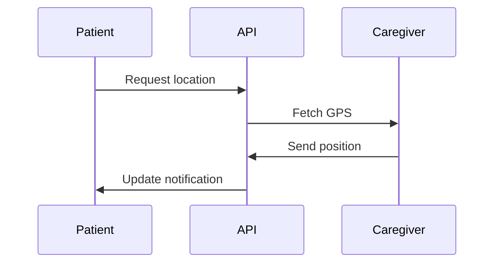

## Overview

PRATHAM RAVAL provides comprehensive tools for home care management. You can book services, match with caregivers, track visits in real-time, process payments securely, and generate analytics reports. These features integrate seamlessly via API at `https://api.example.com` or the dashboard at `https://dashboard.example.com`.

<Callout kind="info">
  Start by creating an account at `https://dashboard.example.com` to access all features.
</Callout>

## Key Features

Discover the core capabilities through these highlighted features.

<Columns cols={2}>
  <Card title="Service Booking" icon="calendar" href="#service-booking">
    Schedule home care visits with flexible time slots and recurring options.
  </Card>
  <Card title="Caregiver Matching" icon="users" href="#caregiver-matching">
    Find and profile caregivers based on skills, availability, and ratings.
  </Card>
  <Card title="Real-time Tracking" icon="map-pin" href="#real-time-tracking">
    Monitor caregiver locations and receive instant notifications.
  </Card>
  <Card title="Payment Processing" icon="credit-card" href="#payment-processing">
    Handle invoicing and secure payments with automated receipts.
  </Card>
  <Card title="Reporting & Analytics" icon="bar-chart-3" href="#reporting">
    Track usage patterns and generate customizable reports.
  </Card>
</Columns>

## Service Booking and Scheduling

Book services effortlessly. Use the dashboard or integrate via API.

<Tabs>
  <Tab title="Dashboard" icon="monitor">
    Navigate to the scheduling page and select dates.
  </Tab>
  <Tab title="API" icon="code">
    Send a POST request to create bookings.
  </Tab>
</Tabs>

<CodeGroup tabs="JavaScript,Python">
  ```javascript
  const response = await fetch('https://api.example.com/v1/bookings', {
    method: 'POST',
    headers: { 'Authorization': `Bearer ${YOUR_API_KEY}`, 'Content-Type': 'application/json' },
    body: JSON.stringify({
      serviceId: 'elderly-care-123',
      startTime: '2024-10-20T10:00:00Z',
      durationHours: 2,
      recurring: false
    })
  });
  const booking = await response.json();
  console.log(booking.id);
  ```
  ```python
  import requests
  headers = {
      'Authorization': f'Bearer {YOUR_API_KEY}',
      'Content-Type': 'application/json'
  }
  data = {
      'serviceId': 'elderly-care-123',
      'startTime': '2024-10-20T10:00:00Z',
      'durationHours': 2,
      'recurring': False
  }
  response = requests.post('https://api.example.com/v1/bookings', json=data, headers=headers)
  booking = response.json()
  print(booking['id'])
  ```
</CodeGroup>

<ParamField path="serviceId" param-type="string" required="true">
  Identifier for the home care service, e.g., `elderly-care-123`.
</ParamField>

<ParamField path="startTime" param-type="string" required="true">
  ISO 8601 timestamp for the booking start.
</ParamField>

## Caregiver Matching and Profiles

Match caregivers to patient needs using profiles with ratings, certifications, and availability.

<Steps>
  <Step title="Search Caregivers" icon="search">
    Enter requirements like `elderly care` or `post-surgery support`.
  </Step>
  <Step title="Review Profiles" icon="user">
    View ratings, experience, and verified documents.
  </Step>
  <Step title="Assign Match" icon="check-circle">
    Confirm and notify the selected caregiver.
  </Step>
</Steps>

## Real-time Tracking and Notifications

Track caregivers in real-time and get updates.



<Callout kind="tip">
  Enable push notifications in your dashboard settings for `<5min` arrival alerts.
</Callout>

## Payment Processing and Invoicing

Process payments securely after each visit. Invoices generate automatically.

<ResponseField name="invoiceId" field-type="string" required="true">
  Unique invoice identifier.
</ResponseField>

<ResponseField name="amount" field-type="number">
  Total amount in USD, e.g., `150.00`.
</ResponseField>

## Reporting and Analytics

Generate reports on service usage, caregiver performance, and costs.

<Expandable title="Advanced Analytics Filters" default-open="false">

Filter by date range, service type, or caregiver. Export as PDF or CSV.

| Metric          | Description                  | Example Value    |
|-----------------|------------------------------|------------------|
| Total Bookings  | Number of scheduled visits   | `247`            |
| Avg Duration    | Average visit length         | `2.5` hours      |
| Completion Rate | Successful visits percentage | `98%`            |

</Expandable>

<Columns cols={3}>
  <Card title="Quickstart" icon="rocket" href="/quickstart">
    Get started in minutes.
  </Card>
  <Card title="API Reference" icon="code" href="/authentication">
    Integrate programmatically.
  </Card>
  <Card title="Support" icon="help-circle" href="/help-center">
    Need assistance?
  </Card>
</Columns>