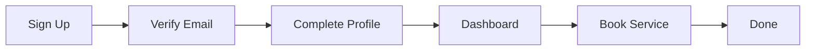

## Prerequisites

Before starting, ensure you have:

- A valid email address
- Access to a modern web browser like Chrome or Firefox
- Basic information about the patient (name, age, required services)

<Callout kind="info">

PRATHAM RAVAL is a web-based platform. No downloads required. All features work on desktop and mobile browsers.
</Callout>

## Create Your Account

Follow these steps to sign up quickly.

<Steps>
  <Step title="Visit the Dashboard" icon="globe">
    Go to `https://dashboard.example.com` and click **Sign Up**.
  </Step>
  <Step title="Enter Details" icon="user">
    Provide your email, full name, and a strong password. Agree to the terms.
  </Step>
  <Step title="Submit" icon="check-circle">
    Click **Create Account**. You'll receive a verification email immediately.
  </Step>
</Steps>

## Verify Email and Complete Profile

Check your inbox for the verification link from PRATHAM RAVAL.

<Steps>
  <Step title="Verify Email" icon="mail">
    Click the link in the email to activate your account.
  </Step>
  <Step title="Complete Profile" icon="edit-3">
    Return to the dashboard. Add patient details: name, age, address, and preferred services like nursing or physiotherapy.
  </Step>
  <Step title="Save Profile" icon="save">
    Click **Update Profile** to finalize setup.
  </Step>
</Steps>

<Callout kind="tip">

Upload a profile photo and emergency contacts for faster service matching.
</Callout>

## Explore the Dashboard

The dashboard provides quick access to key features.

<Columns cols={3}>
  <Card title="Bookings" icon="calendar" href="/dashboard/bookings">
    View upcoming and past home care sessions.
  </Card>
  <Card title="Caregivers" icon="users" href="/dashboard/caregivers">
    Browse available nurses and therapists.
  </Card>
  <Card title="Reports" icon="bar-chart-3" href="/dashboard/reports">
    Track service history and payments.
  </Card>
</Columns>

## Book Your First Home Care Service

Book a service via the web interface or API.

<Tabs>
  <Tab title="Web Dashboard" icon="monitor">
    <Steps>
      <Step title="Select Service" icon="search">
        Navigate to **Book Service** and choose type (e.g., nursing).
      </Step>
      <Step title="Pick Date & Caregiver" icon="calendar">
        Select date, time, and available caregiver.
      </Step>
      <Step title="Confirm & Pay" icon="credit-card">
        Review details and complete payment.
      </Step>
    </Steps>
  </Tab>
  <Tab title="API (Advanced)" icon="code">
    Use the booking endpoint for programmatic access.

    <CodeGroup tabs="JavaScript,cURL">
      ```javascript
      const response = await fetch('https://api.example.com/v1/bookings', {
        method: 'POST',
        headers: {
          'Authorization': 'Bearer YOUR_TOKEN',
          'Content-Type': 'application/json'
        },
        body: JSON.stringify({
          patient_id: 'pat_12345',
          service_type: 'nursing',
          date: '2024-10-20',
          duration_hours: 4
        })
      });
      const booking = await response.json();
      console.log(booking);
      ```
      ```bash
      curl -X POST https://api.example.com/v1/bookings \
        -H "Authorization: Bearer YOUR_TOKEN" \
        -H "Content-Type: application/json" \
        -d '{
          "patient_id": "pat_12345",
          "service_type": "nursing",
          "date": "2024-10-20",
          "duration_hours": 4
        }'
      ```
    </CodeGroup>

    <ParamField path="patient_id" param-type="string" required="true">
      Unique patient identifier from your profile.
    </ParamField>

    <ParamField path="service_type" param-type="string" required="true">
      Type of service: `nursing`, `physiotherapy`, `elderly_care`.
    </ParamField>
  </Tab>
</Tabs>

## Initial Configuration Tips

Customize your account for optimal use.

<Expandable title="Payment Methods" default-open="true">
  Add credit cards or bank details under **Settings > Payments**. Enable auto-pay for recurring services.
</Expandable>

<Expandable title="Notifications">
  Configure email and SMS alerts for booking confirmations and caregiver arrivals in **Settings > Notifications**.
</Expandable>

<Callout kind="success">

Congratulations! You've set up PRATHAM RAVAL. Book more services or explore reports next.

For advanced features, see [Authentication](/authentication) or [Dashboard Guide](/introduction).
</Callout>

